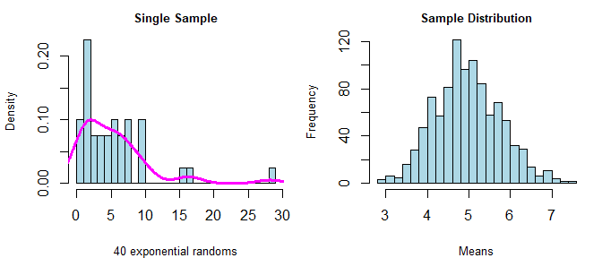
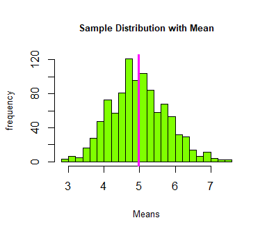

# Part I: Simulation

### Summary

The simulation and discussion below illustrate the Law of Large Numbers
(LLN) and the Central Limit Theorem (CLT) in action. The LLN states that
as *n* increases, statistical estimates approach the true population’s
value . The CLT states that as *n* increases, the averages of variables
become normally distributed (despite the shape of the original
distribution). For distributions that are not normal, as *n* increases,
the sample means will be normally distributed. Therefore, we can use the
properties of normal distribution to make inferences about a population
from a sample.

Let’s demonstrate the distribution of sample means by simulating an
exponential distribution 1000 times. \## Simulation First, let’s
generate and visualize the data.

    set.seed(301)
    lambda<-0.2
    n<-40

    # single sample
    singlesample<-rexp(n, lambda)

    # 1000 sample means
    Ksims<-NULL
    for (i in 1 : 1000) Ksims = c(Ksims, mean(rexp(n, lambda)))

    # side by side
    par(mfrow=c(1,2), mar=c(4,4,2,1))
    hist(singlesample, prob=TRUE, breaks=20, main="Single Sample", 
         cex.main=.8, col="lightblue", xlab="40 exponential randoms", cex.lab=.8)
    lines(density(singlesample), col="magenta", lwd=3, lty=1)
    hist(Ksims, col="lightblue", breaks=20, main="Sample Distribution", 
         cex.main=.8, xlab="1000 Means", cex.lab=.8)

In the first graph, I show a single sample to illustrate the skew of an
exponential distribution. The point is that the data are not normally
distributed. The second graph shows the distribution of the means of
1000 simulated exponential samples, and the data appear normally
distributed.

## The theoretical distribution

The theoretical sample mean for an exponential distribution is 1/lambda.
Lambda was given at 0.2, so the theoretical sample mean is 1/.2 = *5*.
Summarizing the data from our simulation of 1000 exponentials shows both
the range and average of those means. The central limit theorem suggests
that when n is large enough, the mean of the sample mean should approach
the true mean. There appear cases when a single sample mean appears far
from the theoretical mean (the min and max values below). Given our
assumption of normality, however, we can assume that our sample’s mean
will fall within two standard deviations of the true mean 95% of the
time.

    summary(Ksims)

    ##    Min. 1st Qu.  Median    Mean 3rd Qu.    Max. 
    ##   2.858   4.444   4.922   4.971   5.488   7.557

    par(mfrow=c(1,1))
    hist(Ksims, col="chartreuse", breaks=20, main="Sample Distribution with Mean",
         cex.main=.8, xlab="Means", ylab="frequency", cex.lab=.8)
    abline(v=mean(Ksims), lwd=3, col="magenta")

Indeed, the observed sample mean is approximately the theoretical mean;
or, we may say that ‘the estimator is consistent.’ In the figure below,
the pink verticle line represents the sample mean; we see that it is
drawn approximately where x = 5.

## How *Vary* Convenient

The LLN works for other statistics too. Given that the CLT suggests that
the sample mean is normally distributed, and given that we found that
the sample mean is a consistent estimate, we should expect that the
variance of the sample mean is consistent as well. We can compare the
theoretical variance to our sample variance.

The theoretical variance of a random exponential sample is (1/lambda)^2
= 25. The theoretical variance of the sample mean (standard error
squared) is:

    ((1/lambda)/sqrt(n))^2

    ## [1] 0.625

Which we can compare to the variance of our simulation:

    var(Ksims)

    ## [1] 0.6215836

We see that these are *vary* similar. Like with the theoretical and
observed mean, the central limit theorem suggests that when n is large
enough the observed variance should approach the true variance.

## 

Finally, the central limit theorem states that as *n* increases, the
sample mean is normally distributed. Below, I compare the density curve
of our simulated means to a theoretical normal distribution.

    hist(Ksims, prob=TRUE, col="chartreuse", breaks=20, 
         main="Sample Distribution with Density Curves", cex.main=.8,
         xlab="Means", ylab="Frequency", cex.lab=.8)
    lines(density(Ksims), col="magenta", lwd=3, lty=1)

    xfit<-seq(min(Ksims),max(Ksims),length=n^2)
    yfit<-dnorm(xfit, mean=mean(Ksims),sd=sd(Ksims))
    lines(xfit, yfit, col="black", lty=2, lwd=2)

Our sample distribution appears approximately normal.

## Conclusion

The LLN and CLT provide the basis for statistical inference. When n is
large enough, we can use our statistical estimates to make informative
comparisons. Because we can assume normality of sample means, we can use
the properties of the normal distribution to examine the probability
that two samples are meaningfully different. Importantly, this is true
for population distributions that are non-normal in the first place.
